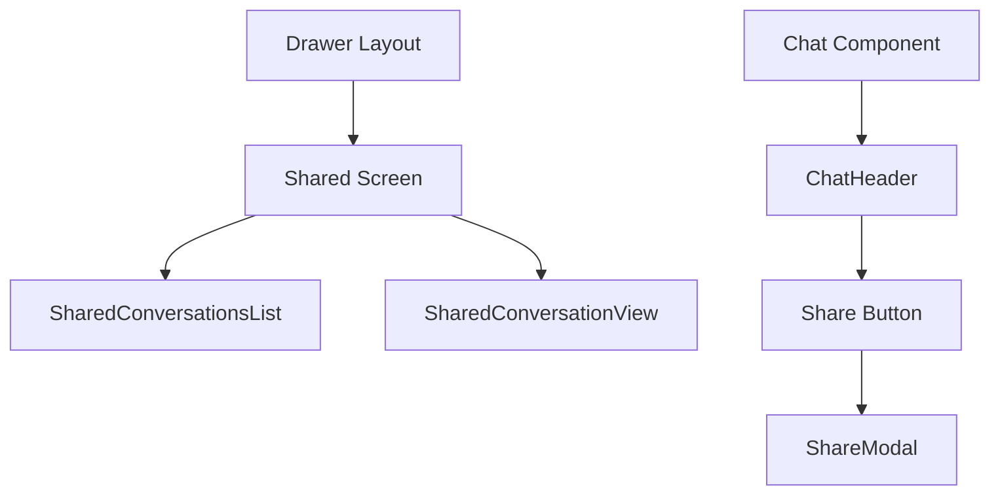

# Sharing Conversations Implementation Plan

This document outlines the implementation plan for the sharing conversations feature, which allows users to share their conversations publicly with read-only access and signature verification.

## Architecture Overview



## 1. API Client Updates

### New Types (model/ShareTypes.ts)
```typescript
interface SharedConversation {
  id: string;
  ownerId: string;
  title: string;
  description?: string;
  createdAt: string;
  messages: string;
  views: number;
  owner: {
    id: string;
    email: string;
  };
}

interface ShareRequest {
  messages: {
    message: {
      role: string;      // 'user' or 'assistant'
      content: string;   // The message content
    };
    signature: string;   // The message signature for verification
  }[];
  title: string;        // Title for the shared conversation
  description?: string; // Optional description
}
```

### ShareApiClient (apiClients/ShareApiClient.ts)
```typescript
class ShareApiClient {
  // Create a new shared conversation
  static async shareConversation(request: ShareRequest): Promise<SharedConversation>;

  // List shared conversations with pagination
  static async listSharedConversations(
    page: number = 1,
    limit: number = 50
  ): Promise<{
    chats: SharedConversation[];
    total: number;
  }>;

  // Get a specific shared conversation
  static async getSharedConversation(id: string): Promise<SharedConversation>;
}
```

## 2. React Query Integration

### Hooks (query-hooks/useSharedConversations.ts)
```typescript
// List shared conversations with pagination
export function useSharedConversations(page: number = 1) {
  return useQuery(['shared-conversations', page], () => 
    ShareApiClient.listSharedConversations(page)
  );
}

// Get a single shared conversation
export function useSharedConversation(id: string) {
  return useQuery(['shared-conversation', id], () =>
    ShareApiClient.getSharedConversation(id)
  );
}

// Share a conversation mutation
export function useShareConversation() {
  return useMutation((request: ShareRequest) =>
    ShareApiClient.shareConversation(request)
  );
}
```

## 3. UI Components

### New Screen (app/(drawer)/shared.tsx)
- Implements the shared conversations list view
- Uses SharedConversationsList component
- Handles navigation to individual conversations

### SharedConversationsList (components/shared/SharedConversationsList.tsx)
- Displays list of shared conversations
- Implements infinite scroll with React Query
- Shows title, creation date, and view count
- Handles empty state and loading states

### SharedConversationView (components/shared/SharedConversationView.tsx)
- Displays a read-only view of a shared conversation
- Shows conversation title and description
- Displays owner information
- Provides option to copy conversation to new chat

### ShareModal (components/shared/ShareModal.tsx)
- Modal for sharing a conversation
- Pre-fills title from chat title
- Optional description field
- Shows loading state during API call
- Handles success/error states

### ChatHeader Updates (components/chat/ChatHeader.tsx)
- Add "Share" text button
- Handle modal open/close
- Show loading state while sharing

## 4. Color Scheme Integration

All new components will use the existing color scheme system:
```typescript
import { Colors } from "../../constants/Colors";
import { useColorScheme } from "../../hooks/useColorScheme";

const colorScheme = useColorScheme();
const theme = Colors[colorScheme ?? 'light'];
```

Components will respect:
- Background colors
- Text colors
- Border colors
- Button colors
- Modal overlay colors

## 5. Error Handling

Error states to handle:
- Network errors during API calls
- Invalid message signatures
- Rate limiting errors
- Authentication errors
- Generic error states

Error handling will use:
- React Query error states
- Toast messages for user feedback
- Retry mechanisms where appropriate
- Clear error messages in the UI

## 6. Implementation Order

1. Create ShareApiClient and types
2. Implement React Query hooks
3. Add Shared screen to drawer navigation
4. Create SharedConversationsList component
5. Create ShareModal component
6. Update ChatHeader with share button
7. Create SharedConversationView component
8. Add error handling and loading states
9. Test and refine UI/UX

## 7. Testing Considerations

- Test message signature verification
- Test pagination and infinite scroll
- Test error states and recovery
- Test modal interactions
- Test color scheme integration
- Test accessibility